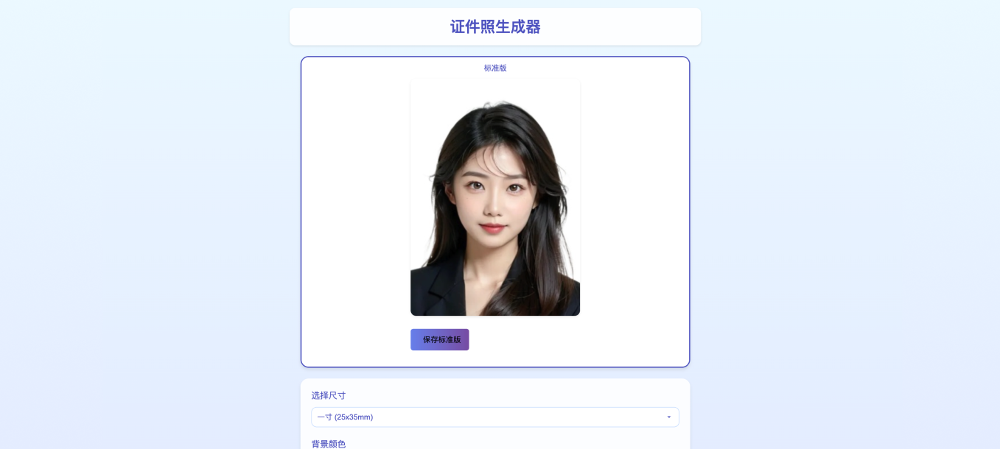

<div align="center">


<h1>HivisionIDPhoto</h1>

[English](README_EN.md) / 中文 / [日本語](README_JP.md) / [한국어](README_KO.md)

[![][release-shield]][release-link]
[![][dockerhub-shield]][dockerhub-link]
[![][github-stars-shield]][github-stars-link]
[![][github-issues-shield]][github-issues-link]
[![][github-contributors-shield]][github-contributors-link]
[![][github-forks-shield]][github-forks-link]
[![][license-shield]][license-link]  
[![][wechat-shield]][wechat-link]
[![][spaces-shield]][spaces-link]
[![][swanhub-demo-shield]][swanhub-demo-link]
[![][modelscope-shield]][modelscope-link]

[![][trendshift-shield]][trendshift-link]
[![][hellogithub-shield]][hellogithub-link]


👋 加入我们的[微信群][wechat-link]

</div>

> **相关项目**：
>
> - [SwanLab](https://github.com/SwanHubX/SwanLab)：训练人像抠图模型全程用它来分析和监控，以及和实验室同学协作交流，大幅提升了训练效率。


<br>

# 目录

- [最近更新](#-最近更新)
- [项目简介](#-项目简介)
- [社区](#-社区)
- [准备工作](#-准备工作)
- [Demo启动](#-运行-gradio-demo)
- [Python推理](#-python-推理)
- [API服务部署](#️-部署-api-服务)
- [Docker部署](#-docker-部署)
- [联系我们](#-联系我们)
- [FAQ](#faq)
- [感谢支持](#-感谢支持)
- [License](#-lincese)
- [引用](#-引用)

<br>

# 🤩 最近更新

- 在线体验： [](https://swanhub.co/ZeYiLin/HivisionIDPhotos/demo)、[](https://huggingface.co/spaces/TheEeeeLin/HivisionIDPhotos)、[![][modelscope-shield]][modelscope-link]

- 2024.09.25: 增加**五寸相纸**和**JPEG下载**选项｜默认照片下载支持300DPI
- 2024.09.24: API接口增加base64图像传入选项 | Gradio Demo增加**排版照裁剪线**功能
- 2024.09.22: Gradio Demo增加**野兽模式**，可设置内存加载策略 | API接口增加**dpi、face_alignment**参数
- 2024.09.18: Gradio Demo增加**分享模版照**功能、增加**美式证件照**背景选项
- 2024.09.17: Gradio Demo增加**自定义底色-HEX输入**功能 | **（社区贡献）C++版本** - [HivisionIDPhotos-cpp](https://github.com/zjkhahah/HivisionIDPhotos-cpp) 贡献 by [zjkhahah](https://github.com/zjkhahah)
- 2024.09.16: Gradio Demo增加**人脸旋转对齐**功能，自定义尺寸输入支持**毫米**单位
- 2024.09.14: Gradio Demo增加**自定义DPI**功能，增加日语和韩语支持，增加**调整亮度、对比度、锐度**功能
- 2024.09.12: Gradio Demo增加**美白**功能 | API接口增加**加水印**、**设置照片KB值大小**、**证件照裁切**

<br>

# 项目简介

> 🚀 谢谢你对我们的工作感兴趣。您可能还想查看我们在图像领域的其他成果，欢迎来信:zeyi.lin@swanhub.co.

HivisionIDPhoto 旨在开发一种实用、系统性的证件照智能制作算法。

它利用一套完善的AI模型工作流程，实现对多种用户拍照场景的识别、抠图与证件照生成。

**HivisionIDPhoto 可以做到：**

1. 轻量级抠图（纯离线，仅需 **CPU** 即可快速推理）
2. 根据不同尺寸规格生成不同的标准证件照、六寸排版照
3. 支持 纯离线 或 端云 推理
4. 美颜
5. 智能换正装（waiting）

<div align="center">

</div>

---

如果 HivisionIDPhoto 对你有帮助，请 star 这个 repo 或推荐给你的朋友，解决证件照应急制作问题！

<br>

# 🏠 社区

我们分享了一些由社区构建的HivisionIDPhotos的有趣应用和扩展：

| [HivisionIDPhotos-ComfyUI][community-hivision-comfyui] | [HivisionIDPhotos-wechat-weapp][community-hivision-wechat] |
| :----------------------------------------------------------------------------------------------------------------------------------------------: | :------------------------------------------------------------------------------------------------------------------------------: |
| <a href="https://github.com/AIFSH/HivisionIDPhotos-ComfyUI">  </a>  | <a href="https://github.com/no1xuan/HivisionIDPhotos-wechat-weapp">  </a>  |
|ComfyUI证件照处理工作流 | 证件照微信小程序（JAVA后端+原生前端） |

| [HivisionIDPhotos-Uniapp][community-hivision-uniapp] | [HivisionIDPhotos-web](https://github.com/jkm199/HivisionIDPhotos-web)|
| :------------------------------------------------------------------------------------------------------------------------------: | :------------------------------------------------------------------------------------------------------------------------------: |
| <a href="https://github.com/soulerror/HivisionIDPhotos-Uniapp">  </a>  | <a href="https://github.com/jkm199/HivisionIDPhotos-web">  </a>  |
| 证件照微信小程序（uniapp）| 证件照应用网页版 |


- [HivisionIDPhotos-cpp](https://github.com/zjkhahah/HivisionIDPhotos-cpp): HivisionIDphotos C++版本，由 [zjkhahah](https://github.com/zjkhahah) 构建
- [ai-idphoto](https://github.com/wmlcjj/ai-idphoto): [HivisionIDPhotos-wechat-weapp](https://github.com/no1xuan/HivisionIDPhotos-wechat-weapp) 的uniapp多端兼容版，由 [wmlcjj](https://github.com/wmlcjj) 贡献
- [HivisionIDPhotos-uniapp-WeChat-gpto1](https://github.com/jkm199/HivisionIDPhotos-uniapp-WeChat-gpto1/): 由gpt-o1辅助完成开发的证件照微信小程序，由 [jkm199](https://github.com/jkm199) 贡献
- [HivisionIDPhotos-windows-GUI](https://github.com/zhaoyun0071/HivisionIDPhotos-windows-GUI)：Windows客户端应用，由 [zhaoyun0071](https://github.com/zhaoyun0071) 构建
- [HivisionIDPhotos-NAS](https://github.com/ONG-Leo/HivisionIDPhotos-NAS): 群晖NAS部署中文教程，由 [ONG-Leo](https://github.com/ONG-Leo) 贡献


<br>

# 🔧 准备工作

环境安装与依赖：
- Python >= 3.7（项目主要测试在 python 3.10）
- OS: Linux, Windows, MacOS

## 1. 克隆项目

```bash
git clone https://github.com/Zeyi-Lin/HivisionIDPhotos.git
cd  HivisionIDPhotos
```

## 2. 安装依赖环境

> 建议 conda 创建一个 python3.10 虚拟环境后，执行以下命令

```bash
pip install -r requirements.txt
pip install -r requirements-app.txt
```

## 3. 下载人像抠图模型权重文件

**方式一：脚本下载**

```bash
python scripts/download_model.py --models all
# 如需指定下载某个模型
# python scripts/download_model.py --models modnet_photographic_portrait_matting
```

**方式二：直接下载**

模型均存到项目的`hivision/creator/weights`目录下：

| 人像抠图模型 | 介绍 | 下载 |
| -- | -- | -- |
| MODNet | [MODNet](https://github.com/ZHKKKe/MODNet)官方权重 | [下载](https://github.com/Zeyi-Lin/HivisionIDPhotos/releases/download/pretrained-model/modnet_photographic_portrait_matting.onnx)(24.7MB)|
| hivision_modnet | 对纯色换底适配性更好的抠图模型 | [下载](https://github.com/Zeyi-Lin/HivisionIDPhotos/releases/download/pretrained-model/hivision_modnet.onnx)(24.7MB) |
| rmbg-1.4 | [BRIA AI](https://huggingface.co/briaai/RMBG-1.4) 开源的抠图模型 | [下载](https://huggingface.co/briaai/RMBG-1.4/resolve/main/onnx/model.onnx?download=true)(176.2MB)后重命名为`rmbg-1.4.onnx` |
| birefnet-v1-lite | [ZhengPeng7](https://github.com/ZhengPeng7/BiRefNet) 开源的抠图模型，拥有最好的分割精度 | [下载](https://github.com/ZhengPeng7/BiRefNet/releases/download/v1/BiRefNet-general-bb_swin_v1_tiny-epoch_232.onnx)(224MB)后重命名为`birefnet-v1-lite.onnx` |

> 如果下载网速不顺利：前往[SwanHub](https://swanhub.co/ZeYiLin/HivisionIDPhotos_models/tree/main)下载。


## 4. 人脸检测模型配置（可选）

| 拓展人脸检测模型 | 介绍 | 使用文档 |
| -- | -- | -- |
| MTCNN | **离线**人脸检测模型，高性能CPU推理（毫秒级），为默认模型，检测精度较低 | Clone此项目后直接使用 |
| RetinaFace | **离线**人脸检测模型，CPU推理速度中等（秒级），精度较高| [下载](https://github.com/Zeyi-Lin/HivisionIDPhotos/releases/download/pretrained-model/retinaface-resnet50.onnx)后放到`hivision/creator/retinaface/weights`目录下 |
| Face++ | 旷视推出的在线人脸检测API，检测精度较高，[官方文档](https://console.faceplusplus.com.cn/documents/4888373) | [使用文档](docs/face++_CN.md)|

## 5. 性能参考

> 测试环境为Mac M1 Max 64GB，非GPU加速，测试图片分辨率为 512x715(1) 与 764×1146(2)。

| 模型组合 | 内存占用 | 推理时长(1) | 推理时长(2) |
| -- | -- | -- | -- |
| MODNet + mtcnn | 410MB | 0.207s | 0.246s |
| MODNet + retinaface | 405MB | 0.571s | 0.971s |
| birefnet-v1-lite + retinaface | 6.20GB | 7.063s | 7.128s |

## 6. GPU推理加速（可选）

在当前版本，可被英伟达GPU加速的模型为`birefnet-v1-lite`，并请确保你有16GB左右的显存。

如需使用英伟达GPU加速推理，在确保你已经安装[CUDA](https://developer.nvidia.com/cuda-downloads)与[cuDNN](https://developer.nvidia.com/cudnn)后，根据[onnxruntime-gpu文档](https://onnxruntime.ai/docs/execution-providers/CUDA-ExecutionProvider.html#cuda-12x)找到对应的`onnxruntime-gpu`版本安装，以及根据[pytorch官网](https://pytorch.org/get-started/locally/)找到对应的`torch`版本安装。

```bash
# 假如你的电脑安装的是CUDA 12.x, cuDNN 8
# 安装torch是可选的，如果你始终配置不好cuDNN，那么试试安装torch
pip install onnxruntime-gpu==1.18.0
pip install torch --index-url https://download.pytorch.org/whl/cu121
```

完成安装后，调用`birefnet-v1-lite`模型即可利用GPU加速推理。

> TIPS: CUDA 支持向下兼容。比如你的 CUDA 版本为 12.6，`torch` 官方目前支持的最高版本为 12.4（<12.6），`torch`仍可以正常使用CUDA。

<br>

# ⚡️ 运行 Gradio Demo

```bash
python app.py
```

运行程序将生成一个本地 Web 页面，在页面中可完成证件照的操作与交互。


<br>

# 🚀 Python 推理

核心参数：

- `-i`: 输入图像路径
- `-o`: 保存图像路径
- `-t`: 推理类型，有idphoto、human_matting、add_background、generate_layout_photos可选
- `--matting_model`: 人像抠图模型权重选择
- `--face_detect_model`: 人脸检测模型选择

更多参数可通过`python inference.py --help`查看

## 1. 证件照制作

输入 1 张照片，获得 1 张标准证件照和 1 张高清证件照的 4 通道透明 png

```python
python inference.py -i demo/images/test0.jpg -o ./idphoto.png --height 413 --width 295
```

## 2. 人像抠图

输入 1 张照片，获得 1张 4 通道透明 png

```python
python inference.py -t human_matting -i demo/images/test0.jpg -o ./idphoto_matting.png --matting_model hivision_modnet
```

## 3. 透明图增加底色

输入 1 张 4 通道透明 png，获得 1 张增加了底色的 3通道图像

```python
python inference.py -t add_background -i ./idphoto.png -o ./idphoto_ab.jpg  -c 4f83ce -k 30 -r 1
```

## 4. 得到六寸排版照

输入 1 张 3 通道照片，获得 1 张六寸排版照

```python
python inference.py -t generate_layout_photos -i ./idphoto_ab.jpg -o ./idphoto_layout.jpg  --height 413 --width 295 -k 200
```

## 5. 证件照裁剪

输入 1 张 4 通道照片（抠图好的图像），获得 1 张标准证件照和 1 张高清证件照的 4 通道透明 png

```python
python inference.py -t idphoto_crop -i ./idphoto_matting.png -o ./idphoto_crop.png --height 413 --width 295
```


<br>

# ⚡️ 部署 API 服务

## 启动后端

```
python deploy_api.py
```

## 请求 API 服务

详细请求方式请参考 [API 文档](docs/api_CN.md)，包含以下请求示例：
- [cURL](docs/api_CN.md#curl-请求示例)
- [Python](docs/api_CN.md#python-请求示例)

<br>

# 🐳 Docker 部署

## 1. 拉取或构建镜像

> 以下方式三选一

**方式一：拉取最新镜像：**

```bash
docker pull linzeyi/hivision_idphotos
```

**方式二：Dockrfile 直接构建镜像：**

在确保将至少一个[抠图模型权重文件](#3-下载权重文件)放到`hivision/creator/weights`下后，在项目根目录执行：

```bash
docker build -t linzeyi/hivision_idphotos .
```

**方式三：Docker compose 构建：**

在确保将至少一个[抠图模型权重文件](#3-下载权重文件)放到`hivision/creator/weights`下后，在项目根目录下执行：

```bash
docker compose build
```

## 2. 运行服务

**启动 Gradio Demo 服务**

运行下面的命令，在你的本地访问 [http://127.0.0.1:7860](http://127.0.0.1:7860/) 即可使用。

```bash
docker run -d -p 7860:7860 linzeyi/hivision_idphotos
```

**启动 API 后端服务**

```bash
docker run -d -p 8080:8080 linzeyi/hivision_idphotos python3 deploy_api.py
```

**两个服务同时启动**

```bash
docker compose up -d
```

## 环境变量

本项目提供了一些额外的配置项，使用环境变量进行设置：

| 环境变量 | 类型	| 描述 | 示例 |
|--|--|--|--|
| FACE_PLUS_API_KEY	 | 可选	| 这是你在 Face++ 控制台申请的 API 密钥	 | `7-fZStDJ····` |
| FACE_PLUS_API_SECRET	 | 可选	| Face++ API密钥对应的Secret | `VTee824E····` |
| RUN_MODE | 可选 | 运行模式，可选值为`beast`(野兽模式)。野兽模式下人脸检测和抠图模型将不释放内存，从而获得更快的二次推理速度。建议内存16GB以上尝试。 | `beast` |
| DEFAULT_LANG | 可选 | Gradio Demo启动时的默认语言| `en` |

docker使用环境变量示例：
```bash
docker run  -d -p 7860:7860 \
    -e FACE_PLUS_API_KEY=7-fZStDJ···· \
    -e FACE_PLUS_API_SECRET=VTee824E···· \
    -e RUN_MODE=beast \
    -e DEFAULT_LANG=en \
    linzeyi/hivision_idphotos  
```

<br>

# FAQ

## 1. 如何修改预设尺寸和颜色？

- 尺寸：修改[size_list_CN.csv](demo/assets/size_list_CN.csv)后再次运行 `app.py` 即可，其中第一列为尺寸名，第二列为高度，第三列为宽度。
- 颜色：修改[color_list_CN.csv](demo/assets/color_list_CN.csv)后再次运行 `app.py` 即可，其中第一列为颜色名，第二列为Hex值。

## 2. 如何修改水印字体？

1. 将字体文件放到`hivision/plugin/font`文件夹下
2. 修改`hivision/plugin/watermark.py`的`font_file`参数值为字体文件名

## 3. 如何添加社交媒体模板照？

1. 将模板图片放到`hivision/plugin/template/assets`文件夹下。模板图片是一个4通道的透明png。
2. 在`hivision/plugin/template/assets/template_config.json`文件中添加最新的模板信息，其中`width`为模板图宽度(px)，`height`为模板图高度(px)，`anchor_points`为模板中透明区域的四个角的坐标(px)；`rotation`为透明区域相对于垂直方向的旋转角度，>0为逆时针，<0为顺时针。
3. 在`demo/processor.py`的`_generate_image_template`函数中的`TEMPLATE_NAME_LIST`变量添加最新的模板名


## 4. 如何修改Gradio Demo的顶部导航栏？

- 修改`demo/assets/title.md`

<br>

# 📧 联系我们

如果您有任何问题，请发邮件至 zeyi.lin@swanhub.co

<br>

# 🙏 感谢支持

[](https://github.com/Zeyi-Lin/HivisionIDPhotos/stargazers)

[](https://github.com/Zeyi-Lin/HivisionIDPhotos/network/members)

[](https://star-history.com/#Zeyi-Lin/HivisionIDPhotos&Date)

贡献者们：

<a href="https://github.com/Zeyi-Lin/HivisionIDPhotos/graphs/contributors">
  
</a>

[Zeyi-Lin](https://github.com/Zeyi-Lin)、[SAKURA-CAT](https://github.com/SAKURA-CAT)、[Feudalman](https://github.com/Feudalman)、[swpfY](https://github.com/swpfY)、[Kaikaikaifang](https://github.com/Kaikaikaifang)、[ShaohonChen](https://github.com/ShaohonChen)、[KashiwaByte](https://github.com/KashiwaByte)

<br>

# 📜 Lincese

This repository is licensed under the [Apache-2.0 License](LICENSE).

<br>

# 📚 引用

如果您在研究或项目中使用了HivisionIDPhotos，请考虑引用我们的工作。您可以使用以下BibTeX条目：

```bibtex
@misc{hivisionidphotos,
      title={{HivisionIDPhotos: A Lightweight and Efficient AI ID Photos Tool}},
      author={Zeyi Lin and SwanLab Team},
      year={2024},
      publisher={GitHub},
      url = {\url{https://github.com/Zeyi-Lin/HivisionIDPhotos}},
}
```


[github-stars-shield]: https://img.shields.io/github/stars/zeyi-lin/hivisionidphotos?color=ffcb47&labelColor=black&style=flat-square
[github-stars-link]: https://github.com/zeyi-lin/hivisionidphotos/stargazers

[swanhub-demo-shield]: https://swanhub.co/git/repo/SwanHub%2FAuto-README/file/preview?ref=main&path=swanhub.svg
[swanhub-demo-link]: https://swanhub.co/ZeYiLin/HivisionIDPhotos/demo

[spaces-shield]: https://img.shields.io/badge/🤗-Open%20in%20Spaces-blue
[spaces-link]: https://huggingface.co/spaces/TheEeeeLin/HivisionIDPhotos

<!-- 微信群链接 -->
[wechat-shield]: https://img.shields.io/badge/WeChat-微信-4cb55e
[wechat-link]: https://docs.qq.com/doc/DUkpBdk90eWZFS2JW

<!-- Github Release -->
[release-shield]: https://img.shields.io/github/v/release/zeyi-lin/hivisionidphotos?color=369eff&labelColor=black&logo=github&style=flat-square
[release-link]: https://github.com/zeyi-lin/hivisionidphotos/releases

[license-shield]: https://img.shields.io/badge/license-apache%202.0-white?labelColor=black&style=flat-square
[license-link]: https://github.com/Zeyi-Lin/HivisionIDPhotos/blob/master/LICENSE

[github-issues-shield]: https://img.shields.io/github/issues/zeyi-lin/hivisionidphotos?color=ff80eb&labelColor=black&style=flat-square
[github-issues-link]: https://github.com/zeyi-lin/hivisionidphotos/issues

[dockerhub-shield]: https://img.shields.io/docker/v/linzeyi/hivision_idphotos?color=369eff&label=docker&labelColor=black&logoColor=white&style=flat-square
[dockerhub-link]: https://hub.docker.com/r/linzeyi/hivision_idphotos/tags

[trendshift-shield]: https://trendshift.io/api/badge/repositories/11622
[trendshift-link]: https://trendshift.io/repositories/11622

[hellogithub-shield]: https://abroad.hellogithub.com/v1/widgets/recommend.svg?rid=8ea1457289fb4062ba661e5299e733d6&claim_uid=Oh5UaGjfrblg0yZ
[hellogithub-link]: https://hellogithub.com/repository/8ea1457289fb4062ba661e5299e733d6

[github-contributors-shield]: https://img.shields.io/github/contributors/zeyi-lin/hivisionidphotos?color=c4f042&labelColor=black&style=flat-square
[github-contributors-link]: https://github.com/zeyi-lin/hivisionidphotos/graphs/contributors

[github-forks-shield]: https://img.shields.io/github/forks/zeyi-lin/hivisionidphotos?color=8ae8ff&labelColor=black&style=flat-square
[github-forks-link]: https://github.com/zeyi-lin/hivisionidphotos/network/members

[modelscope-shield]: https://img.shields.io/badge/Demo_on_ModelScope-purple?logo=data:image/svg+xml;base64,PHN2ZyB3aWR0aD0iMjIzIiBoZWlnaHQ9IjIwMCIgeG1sbnM9Imh0dHA6Ly93d3cudzMub3JnLzIwMDAvc3ZnIj4KCiA8Zz4KICA8dGl0bGU+TGF5ZXIgMTwvdGl0bGU+CiAgPHBhdGggaWQ9InN2Z18xNCIgZmlsbD0iIzYyNGFmZiIgZD0ibTAsODkuODRsMjUuNjUsMGwwLDI1LjY0OTk5bC0yNS42NSwwbDAsLTI1LjY0OTk5eiIvPgogIDxwYXRoIGlkPSJzdmdfMTUiIGZpbGw9IiM2MjRhZmYiIGQ9Im05OS4xNCwxMTUuNDlsMjUuNjUsMGwwLDI1LjY1bC0yNS42NSwwbDAsLTI1LjY1eiIvPgogIDxwYXRoIGlkPSJzdmdfMTYiIGZpbGw9IiM2MjRhZmYiIGQ9Im0xNzYuMDksMTQxLjE0bC0yNS42NDk5OSwwbDAsMjIuMTlsNDcuODQsMGwwLC00Ny44NGwtMjIuMTksMGwwLDI1LjY1eiIvPgogIDxwYXRoIGlkPSJzdmdfMTciIGZpbGw9IiMzNmNmZDEiIGQ9Im0xMjQuNzksODkuODRsMjUuNjUsMGwwLDI1LjY0OTk5bC0yNS42NSwwbDAsLTI1LjY0OTk5eiIvPgogIDxwYXRoIGlkPSJzdmdfMTgiIGZpbGw9IiMzNmNmZDEiIGQ9Im0wLDY0LjE5bDI1LjY1LDBsMCwyNS42NWwtMjUuNjUsMGwwLC0yNS42NXoiLz4KICA8cGF0aCBpZD0ic3ZnXzE5IiBmaWxsPSIjNjI0YWZmIiBkPSJtMTk4LjI4LDg5Ljg0bDI1LjY0OTk5LDBsMCwyNS42NDk5OWwtMjUuNjQ5OTksMGwwLC0yNS42NDk5OXoiLz4KICA8cGF0aCBpZD0ic3ZnXzIwIiBmaWxsPSIjMzZjZmQxIiBkPSJtMTk4LjI4LDY0LjE5bDI1LjY0OTk5LDBsMCwyNS42NWwtMjUuNjQ5OTksMGwwLC0yNS42NXoiLz4KICA8cGF0aCBpZD0ic3ZnXzIxIiBmaWxsPSIjNjI0YWZmIiBkPSJtMTUwLjQ0LDQybDAsMjIuMTlsMjUuNjQ5OTksMGwwLDI1LjY1bDIyLjE5LDBsMCwtNDcuODRsLTQ3Ljg0LDB6Ii8+CiAgPHBhdGggaWQ9InN2Z18yMiIgZmlsbD0iIzM2Y2ZkMSIgZD0ibTczLjQ5LDg5Ljg0bDI1LjY1LDBsMCwyNS42NDk5OWwtMjUuNjUsMGwwLC0yNS42NDk5OXoiLz4KICA8cGF0aCBpZD0ic3ZnXzIzIiBmaWxsPSIjNjI0YWZmIiBkPSJtNDcuODQsNjQuMTlsMjUuNjUsMGwwLC0yMi4xOWwtNDcuODQsMGwwLDQ3Ljg0bDIyLjE5LDBsMCwtMjUuNjV6Ii8+CiAgPHBhdGggaWQ9InN2Z18yNCIgZmlsbD0iIzYyNGFmZiIgZD0ibTQ3Ljg0LDExNS40OWwtMjIuMTksMGwwLDQ3Ljg0bDQ3Ljg0LDBsMCwtMjIuMTlsLTI1LjY1LDBsMCwtMjUuNjV6Ii8+CiA8L2c+Cjwvc3ZnPg==&labelColor=white
[modelscope-link]: https://modelscope.cn/studios/SwanLab/HivisionIDPhotos

<!-- 社区项目链接 -->
[community-hivision-comfyui]: https://github.com/AIFSH/HivisionIDPhotos-ComfyUI
[community-hivision-wechat]: https://github.com/no1xuan/HivisionIDPhotos-wechat-weapp
[community-hivision-uniapp]: https://github.com/soulerror/HivisionIDPhotos-Uniapp
[community-hivision-cpp]: https://github.com/zjkhahah/HivisionIDPhotos-cpp
[community-hivision-windows-gui]: https://github.com/zhaoyun0071/HivisionIDPhotos-windows-GUI
[community-hivision-nas]: https://github.com/ONG-Leo/HivisionIDPhotos-NAS