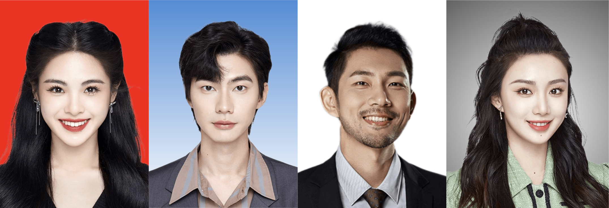
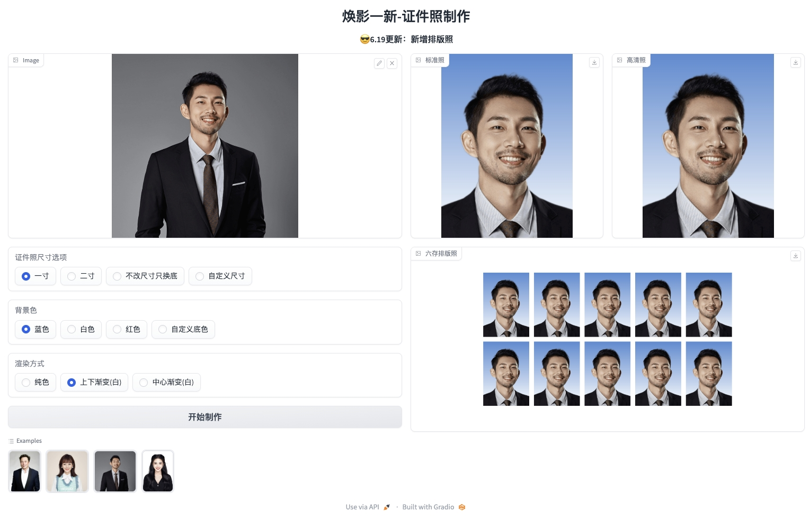

<div align="center">
<h1>HivisionIDPhoto</h1>

English / [中文](README_CN.md)

[](https://github.com/xiaolin199912/HivisionIDPhotos)
[](https://swanhub.co/ZeYiLin/HivisionIDPhotos/demo)
[](https://zhuanlan.zhihu.com/p/638254028)



</div>


# 🤩Project Update
- Online Demo: [](https://swanhub.co/ZeYiLin/HivisionIDPhotos/demo)
- 2023.6.20: Updated **Forecast Size Selection**
- 2023.6.19: Updated **Layout photo**
- 2023.6.13: Updated **center gradient color**
- 2023.6.11: Updated **top and bottom gradient color**
- 2023.6.8: Updated **custom size**
- 2023.6.4: Updated **custom background color and face detection bug notification**
- 2023.5.10: Updated **change background without changing size**
<br>


# Overview

> 🚀Thank you for your interest in our work. You may also want to check out our other achievements in the field of image processing. Please feel free to contact us at zeyi.lin@swanhub.co.

HivisionIDPhoto aims to develop a practical intelligent algorithm for producing ID photos. It uses a complete set of model workflows to recognize various user photo scenarios, perform image segmentation, and generate ID photos. 

**HivisionIDPhoto can:**

1. Perform lightweight image segmentation
2. Generate standard ID photos and six-inch layout photos according to different size specifications
3. Provide beauty features (waiting)
4. Provide intelligent formal wear replacement (waiting)

<div align="center">

</div>

---

If HivisionIDPhoto is helpful to you, please star this repo or recommend it to your friends to solve the problem of emergency ID photo production!


# 🔧Environment Dependencies and Installation

- Python >= 3.7 (Recommend to use [Anaconda](https://www.anaconda.com/download/#linux) or [Miniconda](https://docs.conda.io/en/latest/miniconda.html))
- onnxruntime
- OpenCV
- Option: Linux, Windows, MacOS

### Installation

1. Clone repo

```bash
git lfs install && git clone https://swanhub.co/ZeYiLin/HivisionIDPhotos.git
cd  HivisionIDPhotos
```

2. Install dependent packages

```
pip install numpy
pip install opencv-python
pip install onnxruntime
pip install gradio
```


# ⚡️Quick Inference

The model and code are downloaded through git-lfs.

```
git lfs install
git clone https://swanhub.co/ZeYiLin/HivisionIDPhotos.git
```

**Inference!**

```
python app.py
```

Running the program will generate a local web page where you can complete ID photo operations and interactions.


# Reference Projects
1. MTCNN: https://github.com/ipazc/mtcnn
2. MTCNN-ONNX：https://swanhub.co/ZeYiLin/MTCNN-ONNX
3. ModNet: https://github.com/ZHKKKe/MODNet


# 📧Contact 

If you have any questions, please email Zeyi.lin@swanhub.co


Copyright © 2023, ZeYiLin. All Rights Reserved.

