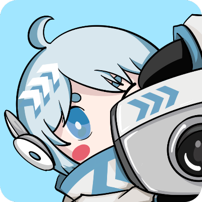

<div align="center">


<h1>HivisionIDPhoto</h1>

[English](README_EN.md) / [中文](README.md) / 日本語 / [한국어](README_KO.md)

[![][release-shield]][release-link]
[![][dockerhub-shield]][dockerhub-link]
[![][github-stars-shield]][github-stars-link]
[![][github-issues-shield]][github-issues-link]
[![][github-contributors-shield]][github-contributors-link]
[![][github-forks-shield]][github-forks-link]
[![][license-shield]][license-link]  
[![][wechat-shield]][wechat-link]
[![][spaces-shield]][spaces-link]
[![][swanhub-demo-shield]][swanhub-demo-link]

[![][trendshift-shield]][trendshift-link]


</div>

<br>

> **関連プロジェクト**：
>
> - [SwanLab](https://github.com/SwanHubX/SwanLab)：トレーニング用のポートレート切り抜きモデルの分析と監視に使用し、実験室の仲間と協力してコミュニケーションを取ることで、トレーニング効率を大幅に向上させました。

<br>

# 目次

- [プロジェクトの更新](#-プロジェクトの更新)
- [概要](#overview)
- [準備作業](#-準備作業)
- [デモの起動](#-実行-gradio-demo)
- [Python推論](#-python-推論)
- [APIサービスのデプロイ](#️-デプロイ-api-サービス)
- [Dockerデプロイ](#-docker-デプロイ)
- [リンク集](#-リンク集)
- [お問い合わせ](#-お問い合わせ)
- [貢献者](#貢献者)

<br>

# 🤩 プロジェクトの更新

- オンライン体験： [](https://swanhub.co/ZeYiLin/HivisionIDPhotos/demo)、[](https://huggingface.co/spaces/TheEeeeLin/HivisionIDPhotos)

- 2024.09.08: 新しい背景除去モデル [RMBG-1.4](https://huggingface.co/briaai/RMBG-1.4) を追加しました | ComfyUI ワークフロー - [HivisionIDPhotos-ComfyUI](https://github.com/AIFSH/HivisionIDPhotos-ComfyUI) は [AIFSH](https://github.com/AIFSH/HivisionIDPhotos-ComfyUI) によって提供されました
- 2024.09.07: **顔検出APIオプション** [Face++](docs/face++_EN.md)を追加し、より高精度な顔検出を実現
- 2024.09.06: 新しい切り抜きモデル [modnet_photographic_portrait_matting.onnx](https://github.com/ZHKKKe/MODNet)を追加
- 2024.09.05: [Restful API ドキュメント](docs/api_EN.md)を更新
- 2024.09.02: **写真のKBサイズ調整**を更新、[DockerHub](https://hub.docker.com/r/linzeyi/hivision_idphotos/tags)
- 2023.12.01: **APIデプロイ（fastapiベース）**を更新
- 2023.06.20: **プリセットサイズメニュー**を更新

# 概要

> 🚀 私たちの仕事に興味を持っていただきありがとうございます。画像分野での他の成果もご覧になりたい場合は、zeyi.lin@swanhub.coまでご連絡ください。

HivisionIDPhotoは、実用的で体系的な証明写真のスマート制作アルゴリズムを開発することを目的としています。

このアルゴリズムは、さまざまなユーザーの撮影シーンを認識し、切り抜き、証明写真を生成するために、整ったAIモデルのワークフローを利用しています。

**HivisionIDPhotoは次のことができます：**

1. 軽量な切り抜き（完全オフライン、**CPU**のみで高速推論可能）
2. 異なるサイズ仕様に基づいて、異なる標準証明写真や六寸レイアウト写真を生成
3. 完全オフラインまたはエッジクラウド推論をサポート
4. 美顔（待機中）
5. スーツの自動変更（待機中）

<div align="center">

</div>

---

HivisionIDPhotoがあなたの役に立った場合は、このリポジトリにスターを付けるか、友人に推薦して、証明写真の緊急制作問題を解決してください！

<br>

# 🔧 準備作業

環境のインストールと依存関係：
- Python >= 3.7（プロジェクトは主にPython 3.10でテストされています）
- OS: Linux, Windows, MacOS

## 1. プロジェクトをクローン

```bash
git clone https://github.com/Zeyi-Lin/HivisionIDPhotos.git
cd  HivisionIDPhotos
```

## 2. 依存環境をインストール

> condaでpython3.10の仮想環境を作成し、以下のコマンドを実行することをお勧めします。

```bash
pip install -r requirements.txt
pip install -r requirements-app.txt
```

## 3. 重みファイルをダウンロード

**方法一：スクリプトでダウンロード**

```bash
python scripts/download_model.py --models all
```

**方法二：直接ダウンロード**

プロジェクトの`hivision/creator/weights`ディレクトリに保存：
- `modnet_photographic_portrait_matting.onnx` (24.7MB): [MODNet](https://github.com/ZHKKKe/MODNet)公式重み、[ダウンロード](https://github.com/Zeyi-Lin/HivisionIDPhotos/releases/download/pretrained-model/modnet_photographic_portrait_matting.onnx)
- `hivision_modnet.onnx` (24.7MB): 単色背景に適した切り抜きモデル、[ダウンロード](https://github.com/Zeyi-Lin/HivisionIDPhotos/releases/download/pretrained-model/hivision_modnet.onnx)
- `mnn_hivision_modnet.mnn` (24.7MB): mnn変換後の切り抜きモデル by [zjkhahah](https://github.com/zjkhahah)、[ダウンロード](https://github.com/Zeyi-Lin/HivisionIDPhotos/releases/download/pretrained-model/mnn_hivision_modnet.mnn)
- `rmbg-1.4.onnx` (176.2MB): [BRIA AI](https://huggingface.co/briaai/RMBG-1.4)からのオープンソースマッティングモデルです。[ダウンロード](https://huggingface.co/briaai/RMBG-1.4/resolve/main/onnx/model.onnx?download=true)して、`rmbg-1.4.onnx`に名前を変更してください。

## 4. 顔検出モデルの設定

> これはオプションです。

| 拡張顔検出モデル | 説明 | 使用文書 |
| -- | -- | -- |
| MTCNN | **オフライン**顔検出モデル、高性能CPU推論、デフォルトモデル、検出精度は低め | このプロジェクトをクローン後に直接使用 |
| Face++ | Megviiが提供するオンライン顔検出API、高精度の検出、[公式文書](https://console.faceplusplus.com.cn/documents/4888373) | [使用文書](docs/face++_EN.md)|

<br>

# 🚀 Gradioデモの実行

```bash
python app.py
```

プログラムを実行すると、ローカルWebページが生成され、そのページで証明写真の操作とインタラクションができます。

<br>

# 🚀 Python推論

コアパラメータ：

- `-i`: 入力画像パス
- `-o`: 保存画像パス
- `-t`: 推論タイプ、idphoto、human_matting、add_background、generate_layout_photosから選択
- `--matting_model`: 人物切り抜きモデルの重み選択、`hivision_modnet`、`modnet_photographic_portrait_matting`が選択可能

詳細なパラメータは、`python inference.py --help`で確認できます。

## 1. 証明写真の制作

1枚の写真を入力し、1枚の標準証明写真と1枚の高解像度証明写真の4チャンネル透明pngを取得

```python
python inference.py -i demo/images/test.jpg -o ./idphoto.png --height 413 --width 295
```

## 2. 人物切り抜き

```python
python inference.py -t human_matting -i demo/images/test.jpg -o ./idphoto_matting.png --matting_model hivision_modnet
```

## 3. 透明画像に背景色を追加

1枚の4チャンネル透明pngを入力し、1枚の背景色を追加した画像を取得

```python
python inference.py -t add_background -i ./idphoto.png -o ./idhoto_ab.jpg  -c 4f83ce -k 30 -r 1
```

## 4. 六寸レイアウト写真の生成

1枚の3チャンネル写真を入力し、1枚の六寸レイアウト写真を取得

```python
python inference.py -t generate_layout_photos -i ./idhoto_ab.jpg -o ./idhoto_layout.jpg  --height 413 --width 295 -k 200
```

<br>

# ⚡️ APIサービスのデプロイ

## バックエンドの起動

```
python deploy_api.py
```

## APIサービスのリクエスト - Pythonリクエスト

> リクエスト方法については[API文書](docs/api_EN.md)を参照してください。これには[cURL](docs/api_EN.md#curl-request-examples)、[Python](docs/api_EN.md#python-request-example)、[Java](docs/api_EN.md#java-request-example)、[Javascript](docs/api_EN.md#javascript-request-examples)リクエスト例が含まれます。

### 1. 証明写真の制作

1枚の写真を入力し、1枚の標準証明写真と1枚の高解像度証明写真の4チャンネル透明pngを取得

```python
import requests

url = "http://127.0.0.1:8080/idphoto"
input_image_path = "demo/images/test.jpg"

files = {"input_image": open(input_image_path, "rb")}
data = {"height": 413, "width": 295}

response = requests.post(url, files=files, data=data).json()

# responseはstatus、image_base64_standard、image_base64_hdの3項目を含むjson形式の辞書です
print(response)

```

### 2. 背景色の追加

1枚の4チャンネル透明pngを入力し、1枚の背景色を追加した画像を取得

```python
import requests

url = "http://127.0.0.1:8080/add_background"
input_image_path = "test.png"

files = {"input_image": open(input_image_path, "rb")}
data = {"color": '638cce', 'kb': None}

response = requests.post(url, files=files, data=data).json()

# responseはstatusとimage_base64を含むjson形式の辞書です
print(response)
```

### 3. 六寸レイアウト写真の生成

1枚の3チャンネル写真を入力し、1枚の六寸レイアウト写真を取得

```python
import requests

url = "http://127.0.0.1:8080/generate_layout_photos"
input_image_path = "test.jpg"

files = {"input_image": open(input_image_path, "rb")}
data = {"height": 413, "width": 295, "kb": 200}

response = requests.post(url, files=files, data=data).json()

# responseはstatusとimage_base64を含むjson形式の辞書です
print(response)
```

<br>

# 🐳 Dockerデプロイ

## 1. イメージのプルまたは構築

> 以下の3つの方法のいずれかを選択

**方法一：最新イメージをプル：**

```bash
docker pull linzeyi/hivision_idphotos
```

**方法二：Dockerfileから直接イメージを構築：**

モデル重みファイル[hivision_modnet.onnx](https://github.com/Zeyi-Lin/HivisionIDPhotos/releases/tag/pretrained-model)を`hivision/creator/weights`に置いた後、プロジェクトのルートディレクトリで実行：

```bash
docker build -t linzeyi/hivision_idphotos .
```

**方法三：Docker composeで構築：**

モデル重みファイル[hivision_modnet.onnx](https://github.com/Zeyi-Lin/HivisionIDPhotos/releases/tag/pretrained-model)を`hivision/creator/weights`に置いた後、プロジェクトのルートディレクトリで実行：

```bash
docker compose build
```

## 2. サービスの実行

**Gradioデモサービスの起動**

以下のコマンドを実行し、ローカルで[http://127.0.0.1:7860](http://127.0.0.1:7860/)にアクセスすれば使用できます。

```bash
docker run -d -p 7860:7860 linzeyi/hivision_idphotos
```

**APIバックエンドサービスの起動**

```bash
docker run -d -p 8080:8080 linzeyi/hivision_idphotos python3 deploy_api.py
```

**2つのサービスを同時に起動**

```bash
docker compose up -d
```

## 環境変数

本プロジェクトはいくつかの追加設定オプションを提供しており、環境変数を使用して設定できます：

| 環境変数 | タイプ | 説明 | 例 |
|--|--|--|--|
| FACE_PLUS_API_KEY | オプション | これはFace++コンソールで申請したAPIキーです | `7-fZStDJ····` |
| FACE_PLUS_API_SECRET | オプション | Face++ APIキーに対応するSecret | `VTee824E····` |

dockerでの環境変数の使用例：
```bash
docker run  -d -p 7860:7860 \
    -e FACE_PLUS_API_KEY=7-fZStDJ···· \
    -e FACE_PLUS_API_SECRET=VTee824E···· \
    linzeyi/hivision_idphotos 
```

<br>

# 🌲 リンク集

- [HivisionIDPhotos-windows-GUI](https://github.com/zhaoyun0071/HivisionIDPhotos-windows-GUI)

<br>

# 📖 引用プロジェクト

1. MTCNN:

```bibtex
@software{ipazc_mtcnn_2021,
    author = {ipazc},
    title = {{MTCNN}},
    url = {https://github.com/ipazc/mtcnn},
    year = {2021},
    publisher = {GitHub}
}
```

2. ModNet:

```bibtex
@software{zhkkke_modnet_2021,
    author = {ZHKKKe},
    title = {{ModNet}},
    url = {https://github.com/ZHKKKe/MODNet},
    year = {2021},
    publisher = {GitHub}
}
```

<br>

# 💻 開発のヒント

**1. プリセットサイズを変更するには？**

[size_list_CN.csv](demo/size_list_CN.csv)を変更後、再度app.pyを実行すればOKです。第一列はサイズ名、第二列は高さ、第三列は幅です。

<br>

# 📧 お問い合わせ

ご不明な点がございましたら、zeyi.lin@swanhub.coまでメールしてください。

<br>

# 貢献者

<a href="https://github.com/Zeyi-Lin/HivisionIDPhotos/graphs/contributors">
  
</a>

[Zeyi-Lin](https://github.com/Zeyi-Lin)、[SAKURA-CAT](https://github.com/SAKURA-CAT)、[Feudalman](https://github.com/Feudalman)、[swpfY](https://github.com/swpfY)、[Kaikaikaifang](https://github.com/Kaikaikaifang)、[ShaohonChen](https://github.com/ShaohonChen)、[KashiwaByte](https://github.com/KashiwaByte)

<br>

# StarHistory

[](https://star-history.com/#Zeyi-Lin/HivisionIDPhotos&Date)

[github-stars-shield]: https://img.shields.io/github/stars/zeyi-lin/hivisionidphotos?color=ffcb47&labelColor=black&style=flat-square
[github-stars-link]: https://github.com/zeyi-lin/hivisionidphotos/stargazers

[swanhub-demo-shield]: https://swanhub.co/git/repo/SwanHub%2FAuto-README/file/preview?ref=main&path=swanhub.svg
[swanhub-demo-link]: https://swanhub.co/ZeYiLin/HivisionIDPhotos/demo

[spaces-shield]: https://img.shields.io/badge/🤗-Open%20in%20Spaces-blue
[spaces-link]: https://huggingface.co/spaces/TheEeeeLin/HivisionIDPhotos

<!-- 微信群链接 -->
[wechat-shield]: https://img.shields.io/badge/WeChat-微信-4cb55e
[wechat-link]: https://docs.qq.com/doc/DUkpBdk90eWZFS2JW

<!-- Github Release -->
[release-shield]: https://img.shields.io/github/v/release/zeyi-lin/hivisionidphotos?color=369eff&labelColor=black&logo=github&style=flat-square
[release-link]: https://github.com/zeyi-lin/hivisionidphotos/releases

[license-shield]: https://img.shields.io/badge/license-apache%202.0-white?labelColor=black&style=flat-square
[license-link]: https://github.com/Zeyi-Lin/HivisionIDPhotos/blob/master/LICENSE

[github-issues-shield]: https://img.shields.io/github/issues/zeyi-lin/hivisionidphotos?color=ff80eb&labelColor=black&style=flat-square
[github-issues-link]: https://github.com/zeyi-lin/hivisionidphotos/issues

[dockerhub-shield]: https://img.shields.io/docker/v/linzeyi/hivision_idphotos?color=369eff&label=docker&labelColor=black&logoColor=white&style=flat-square
[dockerhub-link]: https://hub.docker.com/r/linzeyi/hivision_idphotos/tags

[trendshift-shield]: https://trendshift.io/api/badge/repositories/11622
[trendshift-link]: https://trendshift.io/repositories/11622

[hellogithub-shield]: https://abroad.hellogithub.com/v1/widgets/recommend.svg?rid=8ea1457289fb4062ba661e5299e733d6&claim_uid=Oh5UaGjfrblg0yZ
[hellogithub-link]: https://hellogithub.com/repository/8ea1457289fb4062ba661e5299e733d6

[github-contributors-shield]: https://img.shields.io/github/contributors/zeyi-lin/hivisionidphotos?color=c4f042&labelColor=black&style=flat-square
[github-contributors-link]: https://github.com/zeyi-lin/hivisionidphotos/graphs/contributors

[github-forks-shield]: https://img.shields.io/github/forks/zeyi-lin/hivisionidphotos?color=8ae8ff&labelColor=black&style=flat-square
[github-forks-link]: https://github.com/zeyi-lin/hivisionidphotos/network/members