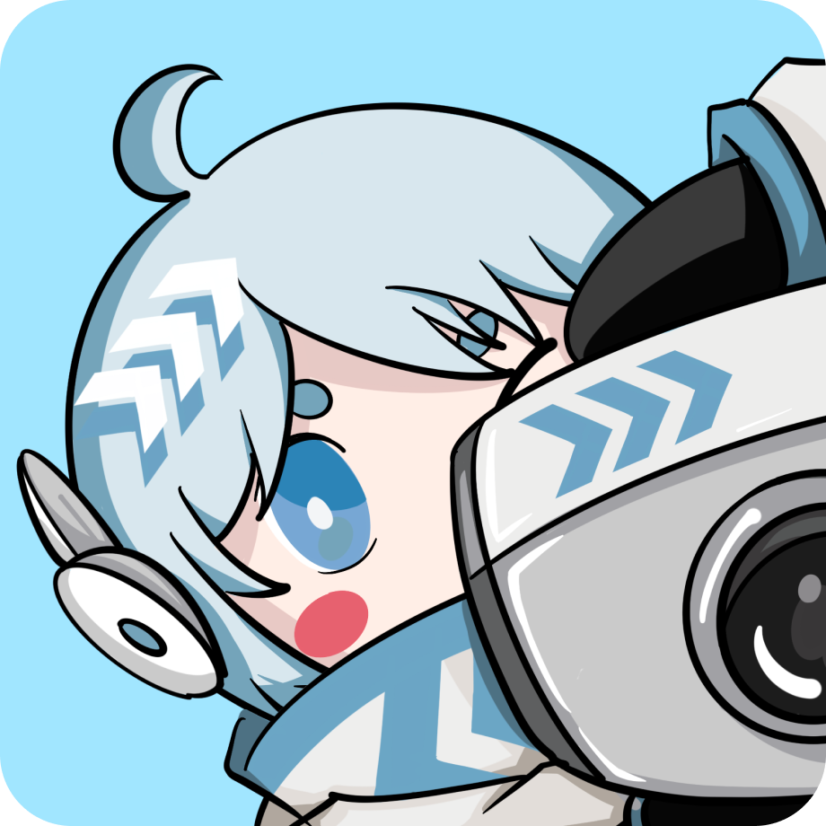
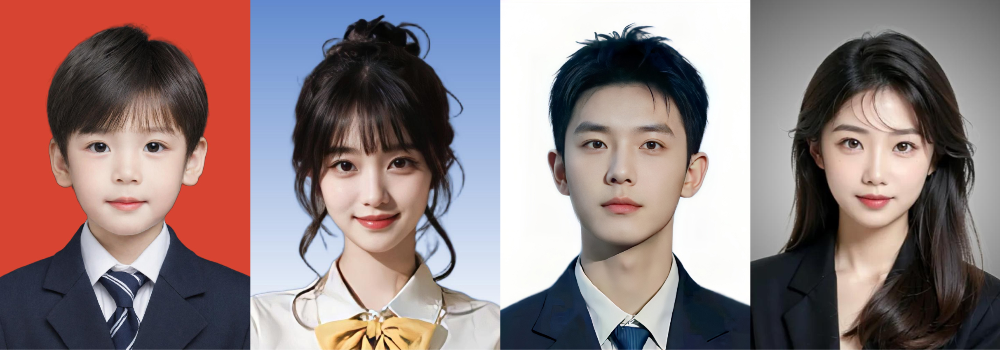
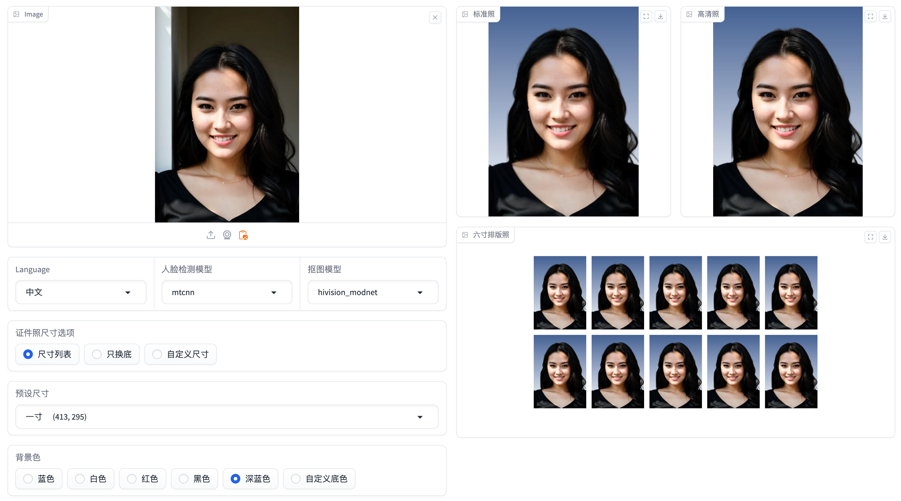
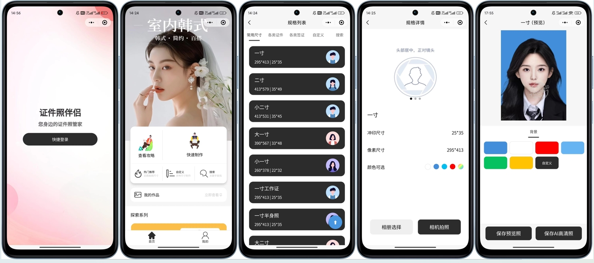
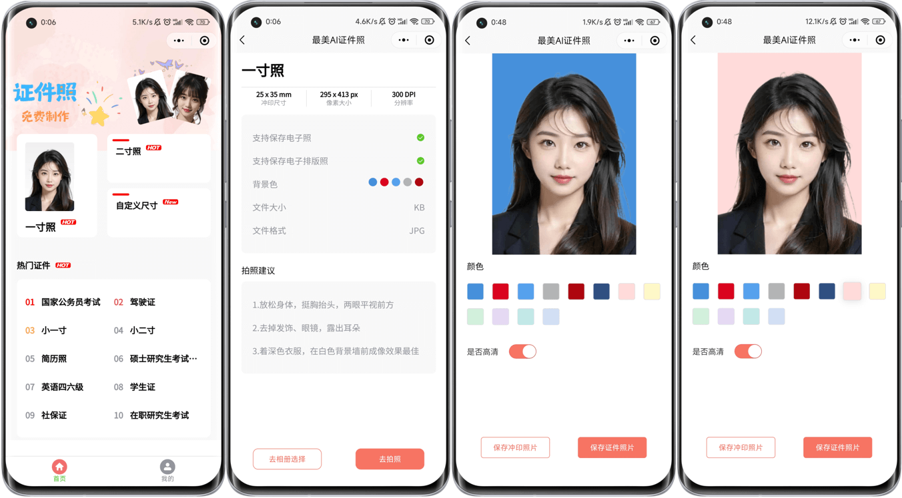
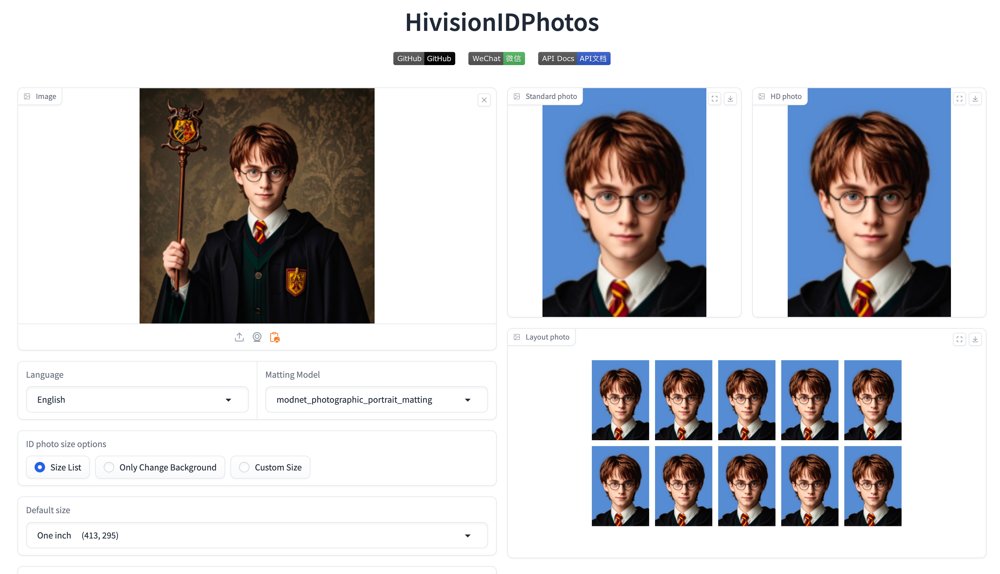
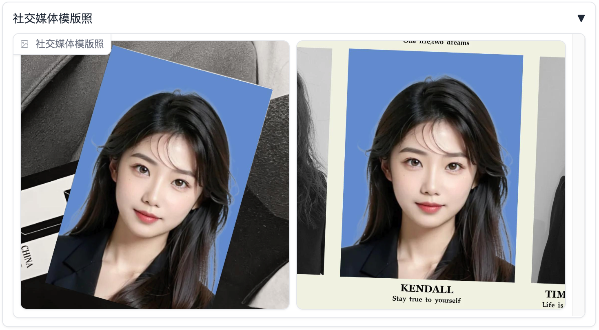

<div align="center">


<h1>HivisionIDPhoto</h1>

[English](README_EN.md) / [中文](README.md) / [日本語](README_JP.md) / 한국어

[![][release-shield]][release-link]
[![][dockerhub-shield]][dockerhub-link]
[![][github-stars-shield]][github-stars-link]
[![][github-issues-shield]][github-issues-link]
[![][github-contributors-shield]][github-contributors-link]
[![][github-forks-shield]][github-forks-link]
[![][license-shield]][license-link]  
[![][wechat-shield]][wechat-link]
[![][spaces-shield]][spaces-link]
[![][swanhub-demo-shield]][swanhub-demo-link]
[![][modelscope-shield]][modelscope-link]

[![][trendshift-shield]][trendshift-link]
[![][hellogithub-shield]][hellogithub-link]



</div>

<br>

> **관련 프로젝트**：
>
> - [SwanLab](https://github.com/SwanHubX/SwanLab)：인물 컷아웃 모델의 훈련을 통해, 분석과 감시, 연구실 동료들과의 협력 및 교류를 진행하여 훈련 효율성을 크게 향상시켰습니다.

<br>

# 목차

- [최근 업데이트](#-최근-업데이트)
- [프로젝트 개요](#-프로젝트-개요)
- [커뮤니티](#-커뮤니티)
- [준비 작업](#-준비-작업)
- [데모 실행](#-데모-실행)
- [Python 추론](#-python-추론)
- [API 서비스 배포](#️-API-서비스-배포)
- [Docker 배포](#-docker-배포)
- [문의하기](#-문의하기)
- [기여자](#기여자)

<br>

# 🤩 최근 업데이트

- 온라인 체험: [](https://swanhub.co/ZeYiLin/HivisionIDPhotos/demo)、[](https://huggingface.co/spaces/TheEeeeLin/HivisionIDPhotos)、[![][modelscope-shield]][modelscope-link]

- 2024.09.24: API 인터페이스에 base64 이미지 입력 옵션 추가 | Gradio 데모에 **레이아웃 사진 자르기 선** 기능 추가
- 2024.09.22: Gradio Demo에 **버스트 모드** 및 **DPI** 매개변수 추가
- 2024.09.18: Gradio Demo에 **템플릿 사진 공유** 기능 추가, **미국식** 배경 옵션 추가
- 2024.09.17: Gradio Demo에 **커스텀 배경색-HEX 입력** 기능 추가 | **(커뮤니티 기여) C++ 버전** - [HivisionIDPhotos-cpp](https://github.com/zjkhahah/HivisionIDPhotos-cpp) 기여 by [zjkhahah](https://github.com/zjkhahah)
- 2024.09.16: Gradio Demo에 **얼굴 회전 정렬** 기능 추가, 커스텀 사이즈 입력에 **밀리미터** 단위 추가
- 2024.09.14: Gradio Demo에 **커스텀 DPI** 기능 추가, 일본어와 한국어 추가, **밝기, 대비, 선명도 조절** 기능 추가
- 2024.09.12: Gradio 데모에 **미백** 기능 추가 | API 인터페이스에 **워터마크 추가**, **사진 KB 크기 설정**, **증명사진 자르기** 추가

<br>

# 프로젝트 개요

> 🚀 우리의 작업에 관심을 가져 주셔서 감사합니다. 이미지 분야의 다른 성과도 꼭 확인해 주시기 바랍니다. 문의는 zeyi.lin@swanhub.co로 해주세요.

HivisionIDPhoto는 실용적이고 체계적인 증명사진의 스마트 제작 알고리즘을 개발하는 것을 목표로 합니다.

다양한 사용자 촬영 장면의 인식, 컷아웃 및 증명사진 생성을 실현하기 위해 일련의 세련된 AI 모델 작업 흐름을 활용하고 있습니다.

**HivisionIDPhoto는 다음과 같은 기능을 제공합니다:**

1. 경량 컷아웃 (완전 오프라인에서, **CPU**만으로 신속한 추론 가능)
2. 다양한 사이즈 사양에 따라 다양한 표준 증명사진, 육寸 레이아웃 사진 생성
3. 완전 오프라인 또는 엣지 클라우드 추론 지원
4. 미용 (대기 중)
5. 스마트한 정장 변경 (대기 중)

<div align="center">

</div>

---

HivisionIDPhoto가 여러분에게 도움이 된다면, 이 리포지토리를 스타하거나 친구에게 추천하여 증명사진의 긴급 제작 문제를 해결해 주세요!

<br>

# 🏠 커뮤니티

우리는 커뮤니티에 의해 구축된 HivisionIDPhotos의 흥미로운 애플리케이션 및 확장 기능을 몇 가지 공유합니다:

- [HivisionIDPhotos-ComfyUI](https://github.com/AIFSH/HivisionIDPhotos-ComfyUI): ComfyUI 증명사진 처리 워크플로우, [AIFSH](https://github.com/AIFSH/HivisionIDPhotos-ComfyUI)가 구축

[](https://github.com/AIFSH/HivisionIDPhotos-ComfyUI)

- [HivisionIDPhotos-wechat-weapp](https://github.com/no1xuan/HivisionIDPhotos-wechat-weapp): WeChat 증명사진 미니 프로그램, HivisionIDphotos 알고리즘 기반, [no1xuan](https://github.com/no1xuan)이 기여

[](https://github.com/no1xuan/HivisionIDPhotos-wechat-weapp)

- [HivisionIDPhotos-Uniapp](https://github.com/soulerror/HivisionIDPhotos-Uniapp): 기본 uniapp 증명사진 미니 프로그램 전면, HivisionIDphotos 알고리즘 기반, [soulerror](https://github.com/soulerror)이 기여

[](https://github.com/soulerror/HivisionIDPhotos-Uniapp)

- [HivisionIDPhotos-cpp](https://github.com/zjkhahah/HivisionIDPhotos-cpp): HivisionIDphotos C++ 버전, [zjkhahah](https://github.com/zjkhahah)이 구축
- [HivisionIDPhotos-windows-GUI](https://github.com/zhaoyun0071/HivisionIDPhotos-windows-GUI): Windows 클라이언트 애플리케이션, [zhaoyun0071](https://github.com/zhaoyun0071)이 구축
- [HivisionIDPhotos-NAS](https://github.com/ONG-Leo/HivisionIDPhotos-NAS): Synology NAS 배포 중국어 튜토리얼, [ONG-Leo](https://github.com/ONG-Leo)가 기여


<br>

# 🔧 준비 작업

환경 설치 및 의존성:
- Python >= 3.7 (프로젝트는 주로 python 3.10으로 테스트되었습니다)
- OS: Linux, Windows, MacOS

## 1. 프로젝트 클론하기

```bash
git clone https://github.com/Zeyi-Lin/HivisionIDPhotos.git
cd  HivisionIDPhotos
```

## 2. 의존 환경 설치하기

> conda로 python3.10 가상 환경을 만드는 것을 권장합니다. 그 후, 아래의 명령어를 실행해 주세요.

```bash
pip install -r requirements.txt
pip install -r requirements-app.txt
```

## 3. 가중치 파일 다운로드하기

**방법 1: 스크립트를 통해 다운로드**

```bash
python scripts/download_model.py --models all
```

**방법 2: 직접 다운로드**

프로젝트의 `hivision/creator/weights` 디렉토리에 저장합니다:
- `modnet_photographic_portrait_matting.onnx` (24.7MB): [MODNet](https://github.com/ZHKKKe/MODNet) 공식 가중치, [다운로드](https://github.com/Zeyi-Lin/HivisionIDPhotos/releases/download/pretrained-model/modnet_photographic_portrait_matting.onnx)
- `hivision_modnet.onnx` (24.7MB): 단색 배경에 적응성이 높은 컷아웃 모델, [다운로드](https://github.com/Zeyi-Lin/HivisionIDPhotos/releases/download/pretrained-model/hivision_modnet.onnx)
- `rmbg-1.4.onnx` (176.2MB): [BRIA AI](https://huggingface.co/briaai/RMBG-1.4)의 오픈 소스 컷아웃 모델, [다운로드](https://huggingface.co/briaai/RMBG-1.4/resolve/main/onnx/model.onnx?download=true) 후에 `rmbg-1.4.onnx`로 이름 변경
- `birefnet-v1-lite.onnx`(224MB): [ZhengPeng7](https://github.com/ZhengPeng7/BiRefNet)의 오픈 소스 컷아웃 모델, [다운로드](https://github.com/ZhengPeng7/BiRefNet/releases/download/v1/BiRefNet-general-bb_swin_v1_tiny-epoch_232.onnx) 후에 `birefnet-v1-lite.onnx`로 이름 변경

## 4. 얼굴 검출 모델 설정하기 (선택 사항)

| 확장 얼굴 검출 모델 | 설명 | 사용 문서 |
| -- | -- | -- |
| MTCNN | **오프라인** 얼굴 검출 모델, 고성능 CPU 추론, 기본 모델, 검출 정확도가 낮음 | 이 프로젝트를 클론한 후 직접 사용 |
| Face++ | Megvii에서 제공하는 온라인 얼굴 검출 API, 고정밀 검출, [공식 문서](https://console.faceplusplus.com.cn/documents/4888373) | [사용 문서](docs/face++_EN.md)|

## 5. 성능 참조

> 테스트 환경은 Mac M1 Max 64GB, 비GPU 가속, 테스트 이미지 해상도는 512x715(1) 및 764×1146(2)입니다.

| 모델 조합 | 메모리 사용량 | 추론 시간(1) | 추론 시간(2) |
| -- | -- | -- | -- |
| MODNet + mtcnn | 410MB | 0.207초 | 0.246초 |
| MODNet + retinaface | 405MB | 0.571초 | 0.971초 |
| birefnet-v1-lite + retinaface | 6.20GB | 7.063초 | 7.128초 |

## 6. GPU 추론 가속 (선택 사항)

현재 버전에서 NVIDIA GPU로 가속화할 수 있는 모델은 `birefnet-v1-lite`입니다. 약 16GB의 VRAM이 필요합니다.

NVIDIA GPU를 사용하여 추론을 가속화하려면, CUDA와 cuDNN이 설치되어 있는지 확인한 후, [onnxruntime-gpu 문서](https://onnxruntime.ai/docs/execution-providers/CUDA-ExecutionProvider.html#cuda-12x)에서 해당하는 `onnxruntime-gpu` 버전을 찾아 설치하고, [PyTorch 공식 웹사이트](https://pytorch.org/get-started/locally/)에서 해당하는 `pytorch` 버전을 찾아 설치하세요.

```bash
# 컴퓨터에 CUDA 12.x와 cuDNN 8이 설치되어 있는 경우
# 설치 중 torch를 설치하는 것은 선택 사항입니다. cuDNN을 설정할 수 없는 경우 torch를 설치해 보세요.
pip install onnxruntime-gpu==1.18.0
pip install torch --index-url https://download.pytorch.org/whl/cu121
```

설치 완료 후, `birefnet-v1-lite` 모델을 호출하면 GPU에 의한 추론 가속이 이용됩니다.

> TIPS: CUDA 설치는 하위 호환성이 있습니다. 예를 들어, CUDA 버전이 12.6이고, torch가 현재 지원하는 최대 버전이 12.4인 경우, 컴퓨터에 12.4 버전을 설치할 수 있습니다.

<br>

# 🚀 데모 실행

```bash
python app.py
```

프로그램을 실행하면 로컬 웹 페이지가 생성되어 페이지 내에서 증명사진의 조작 및 상호작용이 가능합니다.



<br>

# 🚀 Python 추론

핵심 매개변수:

- `-i`: 입력 이미지 경로
- `-o`: 저장 이미지 경로
- `-t`: 추론 유형, idphoto, human_matting, add_background, generate_layout_photos 중 선택
- `--matting_model`: 인물 마스크 모델 가중치 선택
- `--face_detect_model`: 얼굴 감지 모델 선택

더 많은 매개변수는 `python inference.py --help`를 통해 확인할 수 있습니다.

## 1. 증명사진 제작

1장의 사진을 입력하여 1장의 표준 증명사진과 1장의 고화질 증명사진의 4채널 투명 PNG를 얻습니다.

```python
python inference.py -i demo/images/test0.jpg -o ./idphoto.png --height 413 --width 295
```

## 2. 인물 마스크

1장의 사진을 입력하여 1장의 4채널 투명 PNG를 얻습니다.

```python
python inference.py -t human_matting -i demo/images/test0.jpg -o ./idphoto_matting.png --matting_model hivision_modnet
```

## 3. 투명 이미지에 배경색 추가

1장의 4채널 투명 PNG를 입력하여 1장의 배경색이 추가된 3채널 이미지를 얻습니다.

```python
python inference.py -t add_background -i ./idphoto.png -o ./idphoto_ab.jpg  -c 4f83ce -k 30 -r 1
```

## 4. 6인치 배치 사진 생성

1장의 3채널 사진을 입력하여 1장의 6인치 배치 사진을 얻습니다.

```python
python inference.py -t generate_layout_photos -i ./idphoto_ab.jpg -o ./idphoto_layout.jpg  --height 413 --width 295 -k 200
```

## 5. 증명사진 자르기

1장의 4채널 사진(마스크 처리된 이미지)을 입력하여 1장의 표준 증명사진과 1장의 고화질 증명사진의 4채널 투명 PNG를 얻습니다.

```python
python inference.py -t idphoto_crop -i ./idphoto_matting.png -o ./idphoto_crop.png --height 413 --width 295
```

<br>

# ⚡️ API 서비스 배포

## 백엔드 시작

```
python deploy_api.py
```

## API 서비스에 요청

자세한 요청 방법은 [API 문서](docs/api_EN.md)를 참조해 주세요. 아래의 요청 예시가 포함됩니다:
- [cURL](docs/api_EN.md#curl-request-examples)
- [Python](docs/api_EN.md#python-request-example)
- [Java](docs/api_EN.md#java-request-example)
- [Javascript](docs/api_EN.md#javascript-request-examples)

<br>

# 🐳 Docker 배포

## 1. 이미지 풀 또는 빌드하기

> 아래의 방법 중 3가지를 선택해 주세요.

**방법 1: 최신 이미지 풀하기:**

```bash
docker pull linzeyi/hivision_idphotos
```

**방법 2: Dockerfile에서 직접 이미지 빌드하기:**

`hivision/creator/weights` 디렉토리에 최소한 하나의 [마스킹 모델 가중치 파일](#3-가중치-파일-다운로드)이 있는지 확인한 후, 프로젝트 루트 디렉토리에서 다음을 실행하세요:

```bash
docker build -t linzeyi/hivision_idphotos .
```

**방법 3: Docker compose로 빌드하기:**

`hivision/creator/weights` 디렉토리에 최소한 하나의 [마스킹 모델 가중치 파일](#3-가중치-파일-다운로드)이 있는지 확인한 후, 프로젝트 루트 디렉토리에서 다음을 실행하세요:

```bash
docker compose build
```

## 2. 서비스 실행

**Gradio 데모 서비스를 시작합니다**

다음 명령어를 실행하여 로컬에서 [http://127.0.0.1:7860](http://127.0.0.1:7860/)에 접근하면 사용 가능합니다.

```bash
docker run -d -p 7860:7860 linzeyi/hivision_idphotos
```

**API 백엔드 서비스를 시작합니다**

```bash
docker run -d -p 8080:8080 linzeyi/hivision_idphotos python3 deploy_api.py
```

**두 개의 서비스를 동시에 시작합니다**

```bash
docker compose up -d
```

## 환경 변수

본 프로젝트는 몇 가지 추가 설정 항목을 제공하며, 환경 변수를 사용하여 설정합니다:

| 환경 변수 | 유형	| 설명 | 예 |
|--|--|--|--|
| FACE_PLUS_API_KEY	 | 선택 사항	| 이는 Face++ 콘솔에서 신청한 API 키입니다.	 | `7-fZStDJ····` |
| FACE_PLUS_API_SECRET	 | 선택 사항	| Face++ API 키에 대응하는 Secret | `VTee824E····` |

docker에서 환경 변수 사용 예:
```bash
docker run  -d -p 7860:7860 \
    -e FACE_PLUS_API_KEY=7-fZStDJ···· \
    -e FACE_PLUS_API_SECRET=VTee824E···· \
    linzeyi/hivision_idphotos 
```

<br>

# 📖 프로젝트 인용

1. MTCNN:

```bibtex
@software{ipazc_mtcnn_2021,
    author = {ipazc},
    title = {{MTCNN}},
    url = {https://github.com/ipazc/mtcnn},
    year = {2021},
    publisher = {GitHub}
}
```

2. ModNet:

```bibtex
@software{zhkkke_modnet_2021,
    author = {ZHKKKe},
    title = {{ModNet}},
    url = {https://github.com/ZHKKKe/MODNet},
    year = {2021},
    publisher = {GitHub}
}
```

<br>

# 자주 묻는 질문 (FAQ)

## 1. 기본 크기와 색상을 어떻게 수정하나요?

- 크기: [size_list_EN.csv](demo/assets/size_list_EN.csv) 파일을 수정한 후 `app.py`를 다시 실행하면 됩니다. 첫 번째 열은 크기 이름, 두 번째 열은 높이, 세 번째 열은 너비입니다.
- 색상: [color_list_EN.csv](demo/assets/color_list_EN.csv) 파일을 수정한 후 `app.py`를 다시 실행하면 됩니다. 첫 번째 열은 색상 이름, 두 번째 열은 Hex 값입니다.

## 2. 워터마크 글꼴을 어떻게 수정하나요?

1. 글꼴 파일을 `hivision/plugin/font` 폴더에 넣습니다.
2. `hivision/plugin/watermark.py` 파일에서 `font_file` 매개변수 값을 글꼴 파일 이름으로 수정합니다.

## 3. 소셜 미디어 템플릿 사진을 어떻게 추가하나요?

1. 템플릿 이미지를 `hivision/plugin/template/assets` 폴더에 넣습니다. 템플릿 이미지는 4채널 투명 PNG입니다.
2. `hivision/plugin/template/assets/template_config.json` 파일에 최신 템플릿 정보를 추가합니다. 여기서 `width`는 템플릿 이미지의 너비(px), `height`는 템플릿 이미지의 높이(px), `anchor_points`는 템플릿의 투명 영역 네 모서리의 좌표(px)입니다. `rotation`은 투명 영역의 수직 방향에 대한 회전 각도로, >0은 반시계 방향, <0은 시계 방향입니다.
3. `demo/processor.py`의 `_generate_image_template` 함수 내의 `TEMPLATE_NAME_LIST` 변수에 최신 템플릿 이름을 추가합니다.



## 4. Gradio Demo의 상단 내비게이션 바를 어떻게 수정하나요?

- `demo/assets/title.md` 파일을 수정합니다.

<br>

# 📧 문의하기

궁금한 점이 있으시면 zeyi.lin@swanhub.co로 이메일을 보내 주세요.

<br>

# 기여자

<a href="https://github.com/Zeyi-Lin/HivisionIDPhotos/graphs/contributors">
  
</a>

[Zeyi-Lin](https://github.com/Zeyi-Lin)、[SAKURA-CAT](https://github.com/SAKURA-CAT)、[Feudalman](https://github.com/Feudalman)、[swpfY](https://github.com/swpfY)、[Kaikaikaifang](https://github.com/Kaikaikaifang)、[ShaohonChen](https://github.com/ShaohonChen)、[KashiwaByte](https://github.com/KashiwaByte)

<br>

# Thanks for support

[](https://github.com/Zeyi-Lin/HivisionIDPhotos/stargazers)

[](https://github.com/Zeyi-Lin/HivisionIDPhotos/network/members)

[](https://star-history.com/#Zeyi-Lin/HivisionIDPhotos&Date)

<br>

# Lincese

This repository is licensed under the [Apache-2.0 License](LICENSE).

[github-stars-shield]: https://img.shields.io/github/stars/zeyi-lin/hivisionidphotos?color=ffcb47&labelColor=black&style=flat-square
[github-stars-link]: https://github.com/zeyi-lin/hivisionidphotos/stargazers

[swanhub-demo-shield]: https://swanhub.co/git/repo/SwanHub%2FAuto-README/file/preview?ref=main&path=swanhub.svg
[swanhub-demo-link]: https://swanhub.co/ZeYiLin/HivisionIDPhotos/demo

[spaces-shield]: https://img.shields.io/badge/🤗-Open%20in%20Spaces-blue
[spaces-link]: https://huggingface.co/spaces/TheEeeeLin/HivisionIDPhotos

<!-- 微信群链接 -->
[wechat-shield]: https://img.shields.io/badge/WeChat-微信-4cb55e
[wechat-link]: https://docs.qq.com/doc/DUkpBdk90eWZFS2JW

<!-- Github Release -->
[release-shield]: https://img.shields.io/github/v/release/zeyi-lin/hivisionidphotos?color=369eff&labelColor=black&logo=github&style=flat-square
[release-link]: https://github.com/zeyi-lin/hivisionidphotos/releases

[license-shield]: https://img.shields.io/badge/license-apache%202.0-white?labelColor=black&style=flat-square
[license-link]: https://github.com/Zeyi-Lin/HivisionIDPhotos/blob/master/LICENSE

[github-issues-shield]: https://img.shields.io/github/issues/zeyi-lin/hivisionidphotos?color=ff80eb&labelColor=black&style=flat-square
[github-issues-link]: https://github.com/zeyi-lin/hivisionidphotos/issues

[dockerhub-shield]: https://img.shields.io/docker/v/linzeyi/hivision_idphotos?color=369eff&label=docker&labelColor=black&logoColor=white&style=flat-square
[dockerhub-link]: https://hub.docker.com/r/linzeyi/hivision_idphotos/tags

[trendshift-shield]: https://trendshift.io/api/badge/repositories/11622
[trendshift-link]: https://trendshift.io/repositories/11622

[hellogithub-shield]: https://abroad.hellogithub.com/v1/widgets/recommend.svg?rid=8ea1457289fb4062ba661e5299e733d6&claim_uid=Oh5UaGjfrblg0yZ
[hellogithub-link]: https://hellogithub.com/repository/8ea1457289fb4062ba661e5299e733d6

[github-contributors-shield]: https://img.shields.io/github/contributors/zeyi-lin/hivisionidphotos?color=c4f042&labelColor=black&style=flat-square
[github-contributors-link]: https://github.com/zeyi-lin/hivisionidphotos/graphs/contributors

[github-forks-shield]: https://img.shields.io/github/forks/zeyi-lin/hivisionidphotos?color=8ae8ff&labelColor=black&style=flat-square
[github-forks-link]: https://github.com/zeyi-lin/hivisionidphotos/network/members

[modelscope-shield]: https://img.shields.io/badge/Demo_on_ModelScope-purple?logo=data:image/svg+xml;base64,PHN2ZyB3aWR0aD0iMjIzIiBoZWlnaHQ9IjIwMCIgeG1sbnM9Imh0dHA6Ly93d3cudzMub3JnLzIwMDAvc3ZnIj4KCiA8Zz4KICA8dGl0bGU+TGF5ZXIgMTwvdGl0bGU+CiAgPHBhdGggaWQ9InN2Z18xNCIgZmlsbD0iIzYyNGFmZiIgZD0ibTAsODkuODRsMjUuNjUsMGwwLDI1LjY0OTk5bC0yNS42NSwwbDAsLTI1LjY0OTk5eiIvPgogIDxwYXRoIGlkPSJzdmdfMTUiIGZpbGw9IiM2MjRhZmYiIGQ9Im05OS4xNCwxMTUuNDlsMjUuNjUsMGwwLDI1LjY1bC0yNS42NSwwbDAsLTI1LjY1eiIvPgogIDxwYXRoIGlkPSJzdmdfMTYiIGZpbGw9IiM2MjRhZmYiIGQ9Im0xNzYuMDksMTQxLjE0bC0yNS42NDk5OSwwbDAsMjIuMTlsNDcuODQsMGwwLC00Ny44NGwtMjIuMTksMGwwLDI1LjY1eiIvPgogIDxwYXRoIGlkPSJzdmdfMTciIGZpbGw9IiMzNmNmZDEiIGQ9Im0xMjQuNzksODkuODRsMjUuNjUsMGwwLDI1LjY0OTk5bC0yNS42NSwwbDAsLTI1LjY0OTk5eiIvPgogIDxwYXRoIGlkPSJzdmdfMTgiIGZpbGw9IiMzNmNmZDEiIGQ9Im0wLDY0LjE5bDI1LjY1LDBsMCwyNS42NWwtMjUuNjUsMGwwLC0yNS42NXoiLz4KICA8cGF0aCBpZD0ic3ZnXzE5IiBmaWxsPSIjNjI0YWZmIiBkPSJtMTk4LjI4LDg5Ljg0bDI1LjY0OTk5LDBsMCwyNS42NDk5OWwtMjUuNjQ5OTksMGwwLC0yNS42NDk5OXoiLz4KICA8cGF0aCBpZD0ic3ZnXzIwIiBmaWxsPSIjMzZjZmQxIiBkPSJtMTk4LjI4LDY0LjE5bDI1LjY0OTk5LDBsMCwyNS42NWwtMjUuNjQ5OTksMGwwLC0yNS42NXoiLz4KICA8cGF0aCBpZD0ic3ZnXzIxIiBmaWxsPSIjNjI0YWZmIiBkPSJtMTUwLjQ0LDQybDAsMjIuMTlsMjUuNjQ5OTksMGwwLDI1LjY1bDIyLjE5LDBsMCwtNDcuODRsLTQ3Ljg0LDB6Ii8+CiAgPHBhdGggaWQ9InN2Z18yMiIgZmlsbD0iIzM2Y2ZkMSIgZD0ibTczLjQ5LDg5Ljg0bDI1LjY1LDBsMCwyNS42NDk5OWwtMjUuNjUsMGwwLC0yNS42NDk5OXoiLz4KICA8cGF0aCBpZD0ic3ZnXzIzIiBmaWxsPSIjNjI0YWZmIiBkPSJtNDcuODQsNjQuMTlsMjUuNjUsMGwwLC0yMi4xOWwtNDcuODQsMGwwLDQ3Ljg0bDIyLjE5LDBsMCwtMjUuNjV6Ii8+CiAgPHBhdGggaWQ9InN2Z18yNCIgZmlsbD0iIzYyNGFmZiIgZD0ibTQ3Ljg0LDExNS40OWwtMjIuMTksMGwwLDQ3Ljg0bDQ3Ljg0LDBsMCwtMjIuMTlsLTI1LjY1LDBsMCwtMjUuNjV6Ii8+CiA8L2c+Cjwvc3ZnPg==&labelColor=white
[modelscope-link]: https://modelscope.cn/studios/SwanLab/HivisionIDPhotos
