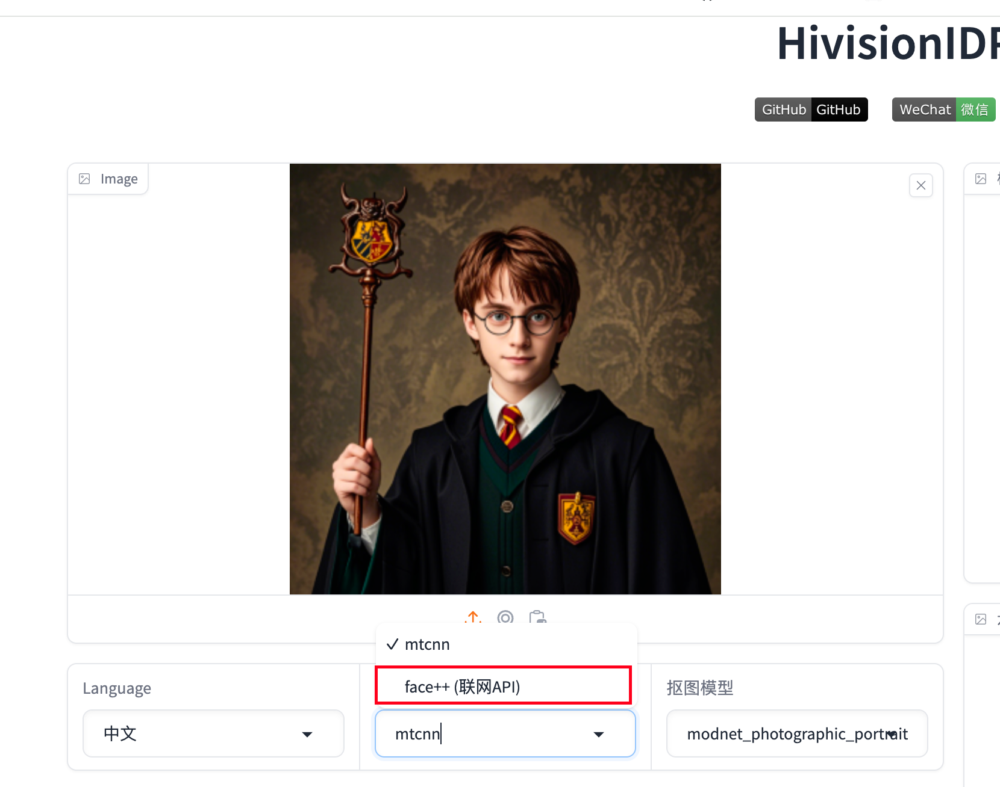

# Face++ 人脸检测配置文档

[Face++官方文档](https://console.faceplusplus.com.cn/documents/4888373)

## 1. 注册Face++账号
要使用 Face++ 的人脸检测 API，您首先需要在 Face++ 的官方网站上注册一个账号。注册后，您将能够访问 API 控制台和相关服务。

### 步骤：
1. 访问 [Face++ 官网](https://www.faceplusplus.com.cn/)。
2. 点击“注册”按钮，填写相关信息以创建您的账号。

## 2. 获取API KEY和API SECRET
注册并登录后，您需要获取用于身份验证的 API Key 和 API Secret。这些信息是调用 API 时必需的。

### 步骤：
1. 登录到您的 Face++ 账号。
2. 进入 控制台 -> 应用管理 -> API Key。
3. 在控制台中，您将看到您的 API Key 和 API Secret。

## 3. 设置环境变量
为了在代码中安全地使用 API Key 和 API Secret，建议将它们设置为环境变量。这样可以避免在代码中硬编码敏感信息。

### 在不同操作系统中设置环境变量的步骤：
- **Windows**:
    1. 打开命令提示符。
    2. 输入以下命令并按回车：
       ```cmd
       set FACE_PLUS_API_KEY="您的API_KEY"
       set FACE_PLUS_API_SECRET="您的API_SECRET"
       ```

- **Linux / macOS**:
    1. 打开终端。
    2. 输入以下命令并按回车：
       ```bash
       export FACE_PLUS_API_KEY="你的API_KEY"
       export FACE_PLUS_API_SECRET="你的API_SECRET"
       ```

> **注意**: 您可能需要在启动应用程序之前运行上述命令，或者将这些命令添加到您的 shell 配置文件（例如 `.bashrc` 或 `.bash_profile`）中，以便每次启动终端时自动加载。

## 4. 启动Gradio服务

运行gradio服务，在「人脸检测模型」中选择「face++」即可。

```bash
python app.py
```



## 错误码的解释

https://console.faceplusplus.com.cn/documents/4888373